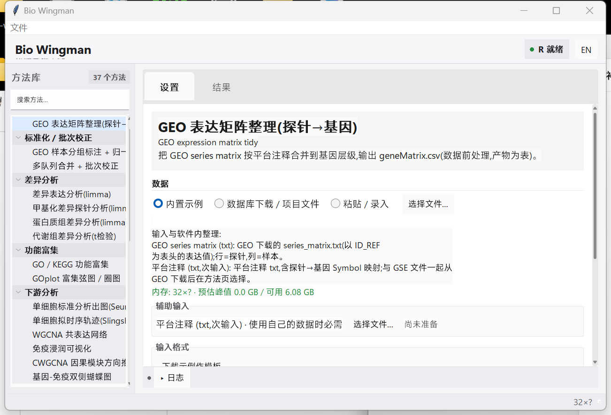

# Bio Wingman 🧬

面向生物信息学分析的**本地桌面软件**——按数据处理流程组织方法,选方法、填参数、点运行,直接出发表级图表和结果表。与 [Meta Wingman](https://gitee.com/fsy2004/meta-wingman) 共用 Python + Tkinter + `sv-ttk` 桌面外壳,复用经过验证的 R / Python 分析模块,无需写代码、无需搭环境服务。

> 定位:把一套可复用的生信分析脚本包装成"turnkey"桌面工具。不是要发新方法,而是让常规流程**一键可跑、可复现、可出图**。



## 仪表板与交互

- **Apple 风格信息层级**:统一工具栏、材料感方法侧栏、留白克制的设置区与结果区;使用 Windows 上成熟的 `sv-ttk` 控件状态,不仿造 macOS 窗口按钮。
- **方法库导航**:侧栏显示当前方法数量,支持中英文即时搜索;顶部同时显示 R / Python 环境状态。
- **设置 / 结果分离**:参数与数据准备放在「设置」页,图表与结果表放在「结果」页;运行失败时日志抽屉自动展开,平时可折叠。
- **键盘操作**:`Ctrl+F` 搜索方法,`Ctrl+1` / `Ctrl+2` 切换设置与结果,`Ctrl+L` 展开或收起日志。
- **中英双语**:右上角切换,不需要重启。

## 按流程分类的方法

左侧方法树按**数据处理阶段**组织(空阶段自动隐藏):

| 阶段 | 内容 | 首批方法 |
|------|------|----------|
| S0 数据获取 / 导入 | GEO 表达矩阵整理 | 1 |
| S1 质控 / 预处理 | 当前无独立入口 | 0 |
| S2 标准化 / 批次校正 | GEO 样本分组、批次校正 | 2 |
| S3 差异分析 | 转录组、甲基化、蛋白质组、代谢组 | 4 |
| S4 功能富集 | GO / KEGG、GOplot 弦图 / 圈图 | 2 |
| S5 下游分析 | WGCNA、单细胞、空间、免疫、突变、亚型 | 10 |
| S6 因果推断 (MR) | 两样本 MR、多变量 MR | 2 |
| S7 建模 / 诊断 (ML) | 特征筛选、诊断与外部验证、预后 | 10 |
| S8 可视化 / 报告 | Sankey、雨云、山脊、弦图、染色体图等 | 6 |

当前共 37 个可选方法。方法数量直接来自 `manifests/*.json`,侧栏会随清单自动更新。

## 亮点

- **原生桌面**:无浏览器、无本地服务;双击 `start.bat` 即用。
- **内存红绿灯**:运行前按数据规模估算内存峰值(WGCNA 随基因数平方增长会预警),避免跑一半 OOM。
- **可复现**:每次运行落地 `reproduce.R` + `data.csv`,一条命令重跑。
- **一键报告**:从产物生成 Word 报告(方法 / 结果 / 参数 / 复现命令 + R `citation()` 真实文献,不臆造)。
- **结果区直用**:图表分标签页;复制图到剪贴板(直接粘进 Word/PPT)、另存 PNG / 矢量 PDF、复制 / 另存表格。
- **中英双语**:界面免重启切换。

## 数据怎么整理

Bio Wingman 的主流程从数据库下载文件开始,不要求用户先在 Excel/R 中拼出分析输入表。选择方法后,「输入与软件内整理」会列出主输入和全部辅助输入;多文件分析不再把用户数据与内置辅助示例混用。运行前还会做缺失输入、必填列和数值类型校验。

当前已经端到端接通 GEO/bulk 主链路:

1. 在「GEO 表达矩阵整理」中选择 GEO 下载的 `series_matrix.txt` 与 GPL 平台注释文件,软件生成基因级 `geneMatrix.csv`。
2. 进入「GEO 样本分组标注 + 归一化」后,上一步矩阵会自动接入;用户在软件内多选样本并标记对照 / 病例,软件自动生成分组表和数值性状表。
3. 归一化矩阵会自动接到差异分析;显著基因结果随后可自动接到 GO/KEGG、LASSO、随机森林、SVM-RFE 和诊断模型,WGCNA 也会接入表达矩阵与软件生成的性状表。

单细胞 counts、Seurat RDS、空间 H5AD、MAF 等已由对应方法直接读取数据库下载文件。TCGA 临床-表达合并、GWAS harmonization 等更复杂来源仍按独立导入器逐步接入;当前版本不会把它们标成“已完全自动整理”。详细边界见 [数据流水线说明](docs/DATA_PIPELINE.md)。

2026-07-22 对全部清单做过一次覆盖审计:

- 37 个方法共声明 55 项输入;每项都有格式、整理说明和实际存在的内置示例,没有空说明或失效示例路径。
- 主输入均可在方法页查看说明并下载示例;适合结构化列映射的 CSV 会显示必填 / 选填提示。
- 15 个多文件方法的 18 项辅助输入现在全部显示在仪表板中,使用项目数据时必须逐项选择、由软件生成或由上游产物自动接入;不会再静默使用不匹配的内置示例。

## 安装 / 使用

**需要**:Windows + Python 3.9+ + R 4.0+。

1. 下载本仓库(或 `git clone`)。
2. 双击 `install.bat`——自动装 Python 包 + R 包(CRAN 走清华镜像;`limma`/`ComplexHeatmap`/`clusterProfiler`/`org.Hs.eg.db` 等 Bioconductor 包走 BiocManager)。
3. 双击 `start.bat` 启动。
4. 随时体检环境:`python setup/env_check.py`。

首次富集分析(S4)需要本地/联网的注释库(`org.Hs.eg.db`),`install.bat` 会一并装好。

## 分析模块来源

分析逻辑来自可复用生信代码库 `bioinfo-reusable-code`(已 vendor 进 `toolkit/modules/`,含 `_framework/` 发表级绘图主题)。每个方法一个 JSON manifest(`manifests/`)声明入口脚本、参数、产物与内存模型;引擎按 manifest 定位解释器(R / Python)、跑子进程、收产物。

## 架构

```
biowingman/     原生 Tkinter 外壳(与 Meta Wingman 共享:引擎/结果区/报告/项目/i18n/内存 doctor)
manifests/      每个方法一个 JSON(entry / 参数 / 产物 / cite_pkgs / 内存模型 / 流程阶段)
toolkit/modules/  vendor 的分析脚本 + _framework 绘图主题
config/         requirements.json(依赖单一权威源)+ column_shapes.json
setup/          env_check.py(环境体检)+ install.ps1 / install_r_packages.R(装 CRAN + Bioc)
```

## 许可

MIT © 2026 fsy2004。vendor 的分析脚本沿用其原始许可(见各模块)。
