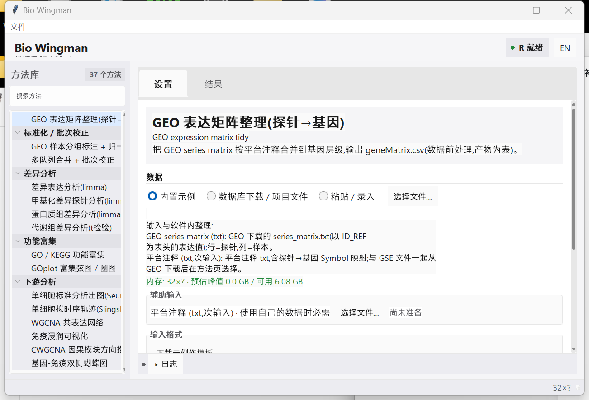

# Bio Wingman 🧬

**把 GEO 和常见组学数据放进本地桌面软件，按流程完成整理、差异分析、富集、WGCNA、机器学习和发表级出图。**

面向 Windows 用户，全程在本机处理数据；无需写 R/Python 代码，也无需启动网页服务。

[](https://github.com/fsy2004/bio-wingman/releases/latest)


[](LICENSE)

## 立即下载

推荐下载完整压缩包。包内已经包含桌面程序、分析脚本和内置示例；Python、R 和分析依赖会在首次安装时从网络获取。

| 下载源 | 完整压缩包 | 适合谁 |
|---|---|---|
| GitHub | [下载 Bio Wingman v0.4.0](https://github.com/fsy2004/bio-wingman/releases/download/v0.4.0/bio-wingman-v0.4.0.zip) | 可以稳定访问 GitHub |
| Gitee | [下载 Bio Wingman v0.4.0](https://gitee.com/fsy2004/bio-wingman/repository/archive/v0.4.0.zip) | 中国大陆网络环境 |

也可以只下载一个启动安装器：[Gitee `install.bat`](https://gitee.com/fsy2004/bio-wingman/raw/master/install.bat) · [GitHub `install.bat`](https://raw.githubusercontent.com/fsy2004/bio-wingman/master/install.bat)。它会自动下载完整项目，电脑没有 Git 时会改用 ZIP。

> 当前提供的是 Windows 源码安装包，不是免环境的单文件 EXE。开始前请安装 [Python 3.9+](https://www.python.org/downloads/windows/) 和 [R 4.0+](https://cran.r-project.org/bin/windows/base/)；推荐使用 64 位版本。

## 四步启动

1. 解压下载的 ZIP，进入 `bio-wingman` 文件夹。
2. 双击 `install.bat`，等待 Python、CRAN 和 Bioconductor 依赖安装完成。单细胞/空间分析依赖较大，首次安装可能需要较长时间。
3. 双击 `start.bat`，打开 Bio Wingman。
4. 左侧选方法，确认数据和参数后点「运行」；成功后软件自动切到「结果」页。

如果窗口没有打开，在项目文件夹空白处按住 `Shift` 并右键打开 PowerShell，运行：

```powershell
python setup\env_check.py
python -m biowingman
```

第一条命令会指出缺少的 Python/R 版本或软件包，第二条会显示完整启动错误。



## 用内置数据完成第一次分析

先用示例确认环境和出图链路，通常几分钟即可完成：

1. 启动软件，在左侧搜索「GEO 表达矩阵整理」。
2. 保持「内置示例」，点击「运行（示例数据）」。
3. 分析完成后进入「结果」，查看生成的 `geneMatrix.csv`。
4. 再选择「差异表达分析（limma）」并运行示例，可看到 PCA、火山图、热图和差异基因表。
5. 点击「打开输出文件夹」查看全部文件；图可另存 PNG/PDF，表可复制或另存 CSV。

这一步不会使用你的数据，也不会上传任何文件。

## 处理自己的 GEO 数据

Bio Wingman 已接通 GEO bulk 芯片数据的主链路：

```text
GEO series_matrix.txt + GPL 平台注释
  → 探针映射与基因聚合
  → geneMatrix.csv
  → 软件内标记对照组 / 病例组
  → 归一化表达矩阵 + sample_traits.csv
  ├─→ limma 差异分析 → 火山图 / PCA / 热图 / 差异基因表
  ├─→ GO / KEGG、LASSO、随机森林、SVM-RFE、诊断模型
  └─→ WGCNA
```

### 1. 从 GEO 下载文件

在目标 GSE 的 GEO 页面下载：

- `GSE..._series_matrix.txt`（或压缩版本）：探针 × 样本表达矩阵；
- 对应 `GPL...` 平台注释文件：至少包含探针 ID 和基因 Symbol。

### 2. 在软件中整理表达矩阵

1. 选择「GEO 表达矩阵整理（探针→基因）」。
2. 切换到「数据库下载 / 项目文件」。
3. 依次选择 series matrix 和 GPL 注释文件。
4. 查看 GPL 文件，填写基因 Symbol 所在列号（从 1 开始）。
5. 运行后得到基因级 `geneMatrix.csv`。

### 3. 在软件中完成样本分组

1. 选择「GEO 样本分组标注 + 归一化」，上一步矩阵会自动接入。
2. 点击「在软件中划分样本」，多选样本并标记为对照组 `con` 或病例/处理组 `tre`。
3. 保存分组并运行，软件生成归一化矩阵和数值性状表。

样本分组涉及研究语义，软件会要求你确认，不会依据样本名擅自判断病例和对照。

### 4. 接着做下游分析

选择「差异表达分析（limma）」时，最新归一化矩阵会自动接入。差异基因结果可以继续用于 GO/KEGG 和特征筛选；表达矩阵及性状表可接入 WGCNA。方法页会列出所有主输入和辅助输入，缺少必填文件或列时运行按钮会停用并显示原因。

更完整的数据边界见 [Bio Wingman 数据流水线](docs/DATA_PIPELINE.md)。

## 其他数据怎么导入

| 数据类型 | 推荐入口 | 常用输入 |
|---|---|---|
| 常规 bulk 表达矩阵 | 差异分析、批次校正、WGCNA、ML | CSV/TSV，首列基因，其余列为样本 |
| 单细胞 | 单细胞发表级绘图、轨迹分析 | counts、Seurat RDS 等方法页指定文件 |
| 空间转录组 | Squidpy 空间统计、细胞通讯 | H5AD 或方法页指定对象 |
| 突变 | maftools | `.maf` / `.maf.gz` |
| 甲基化、蛋白质组、代谢组 | 对应差异分析 | 数据矩阵 + 样本注释 |
| MR | 两样本 MR、多变量 MR | 已 harmonize 的 GWAS 汇总数据 |

每个方法都带真实示例。选中方法后先查看「输入格式」和示例前几行，也可下载示例作为模板。TCGA 临床-表达自动合并、原始 GWAS harmonization 等复杂导入仍在逐步完善；当前版本需要用户先准备对应好的输入表。

## 分析范围

当前仪表板由 `manifests/*.json` 自动加载 37 个方法：

| 阶段 | 主要内容 |
|---|---|
| S0 数据获取 / 导入 | GEO 表达矩阵整理 |
| S2 标准化 / 批次校正 | 样本分组、归一化、多队列批次校正 |
| S3 差异分析 | 转录组、甲基化、蛋白质组、代谢组 |
| S4 功能富集 | GO/KEGG、富集弦图/圈图 |
| S5 下游分析 | WGCNA、单细胞、空间、免疫、突变、亚型 |
| S6 因果推断 | 两样本 MR、多变量 MR |
| S7 建模 / 诊断 | LASSO、随机森林、SVM-RFE、诊断与预后模型 |
| S8 可视化 / 报告 | Sankey、雨云、山脊、弦图、染色体图等 |

## 结果在哪里

- 软件结果页：直接预览图和表，复制到 Word/PPT，或导出 PNG、矢量 PDF、CSV。
- 完整运行目录：`%LOCALAPPDATA%\BioWingman\runs`。
- 每次运行：保留输入副本、参数、日志和可复现脚本；可从结果生成 Word 报告。

## 常见问题

### `start.bat` 一闪而过

先运行 `python setup\env_check.py`。如果提示找不到 Python 或 R，安装后关闭并重新打开终端，再启动软件。

### 安装依赖很慢

默认使用清华 TUNA。安装脚本支持自定义 pip、CRAN 和 Bioconductor 源，详见 `setup/install.ps1` 顶部参数说明。

### GEO 文件运行失败

确认 series matrix 内存在 `ID_REF` 表头行，GPL 文件是制表符分隔，并且「基因 Symbol 所在列号」填写正确。错误详情会自动展开在底部日志中。

### 找不到结果

点击结果页的「打开输出文件夹」，或在资源管理器地址栏输入 `%LOCALAPPDATA%\BioWingman\runs`。

## 隐私与适用范围

- 项目数据在本机读取和计算，Bio Wingman 不提供数据上传服务。
- 安装依赖和首次获取 R 注释包时需要联网。
- 软件用于可复现的科研分析流程，统计模型、分组和生物学解释仍需研究者审核。

## 从源码运行

```powershell
git clone https://github.com/fsy2004/bio-wingman.git
cd bio-wingman
powershell -ExecutionPolicy Bypass -File setup\install.ps1
python setup\env_check.py
python -m biowingman
```

Gitee 镜像：

```powershell
git clone https://gitee.com/fsy2004/bio-wingman.git
```

项目结构：

```text
biowingman/       Tkinter 桌面应用、运行引擎、结果区、报告、项目与数据接线
manifests/        方法入口、参数、输入、产物、引用包和内存模型
toolkit/modules/  可复用 R/Python 分析脚本与发表级绘图主题
config/           依赖、版本门槛和输入列结构
setup/            环境体检和依赖安装脚本
docs/             数据流水线与界面说明
```

## 许可

Bio Wingman 采用 [MIT License](LICENSE)，© 2026 fsy2004。`toolkit/modules/` 中引入的分析模块沿用各自的原始许可。
